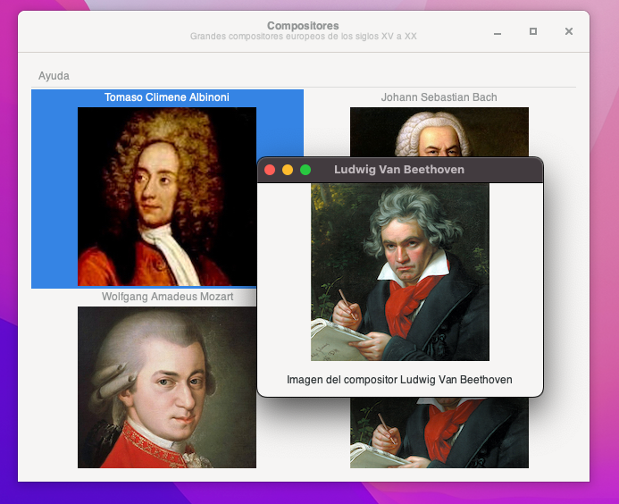

# composers

A simple app to learn more about classical music composers



## Requirements

You need Python 3, the PyGObject3 and Gtk+3 libraries.
Also, you need the requests library for python.

Under MacOS, use Homebrew and pip3:
```
$ brew install gtk+3 pygobject3 adwaita-icon-theme
$ pip3 install requests
```